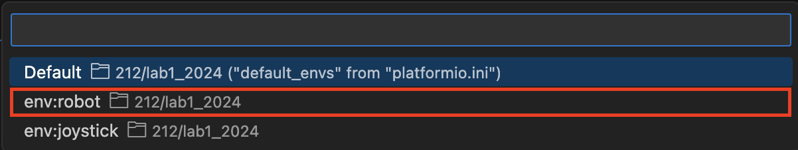
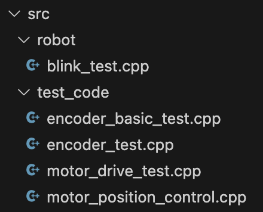

# Lab 1: Software Configuration

2.12/2.120 Intro to Robotics  
Spring 2024

## Table of Contents
- [1 Pre-Lab: Set Up Environment](#1-pre-lab-set-up-environment)
  - [1.1 Visual Studio Code](#11-visual-studio-code)
  - [1.2 Python](#12-python)
  - [1.3 Git](#13-git)
  - [1.4 PlatformIO](#14-platformio)
- [2 Set Up Hardware](#2-set-up-hardware)
- [3 Validate Microcontroller](#3-validate-microcontroller)
- [4 Validate Encoder](#4-validate-encoder)
- [5 Validate Motor](#5-validate-motor)

## 1 Pre-Lab: Set Up Environment
Please install the following software to ensure a smooth experience during our lab sessions. If you have already installed any of the following software, you can feel free to skip the corresponding section.

If you run into any bugs or encounter issues during the installation process, don't waste too much time trying to debug the problem. Setting up a development environment for the first time can often be frustrating. Feel free to bring any issues to your lab section, and we will help you resolve them.

### 1.1 Visual Studio Code

Visual Studio Code is a popular and lightweight code editor that provides a user-friendly interface for coding. We will be using Visual Studio Code extensively throughout this class to program and communicate with the hardware.

You can download it here: https://code.visualstudio.com/Download. 

### 1.2 Python

Python is a versatile and widely-used programming language. We will use Python for writing and executing code in this class.

You can download it here: https://www.python.org/downloads/. Make sure to check the box that says "Add Python X.X to PATH" during installation.

### 1.3 Git

Git is a distributed version control system that allows for efficient collaboration and tracking changes in code. We will use Git to manage our code repositories.

You can download it here: https://git-scm.com/downloads.

In order to clone a repository using the command line through SSH, you need to set up SSH keys:
1. Generate a new SSH key using the following instructions: [Generating a new SSH key](https://docs.github.com/en/authentication/connecting-to-github-with-ssh/generating-a-new-ssh-key-and-adding-it-to-the-ssh-agent#generating-a-new-ssh-key).
2. Add the SSH key to the ssh-agent using the following instructions: [Adding your SSH key to the ssh-agent](https://docs.github.com/en/authentication/connecting-to-github-with-ssh/generating-a-new-ssh-key-and-adding-it-to-the-ssh-agent#adding-your-ssh-key-to-the-ssh-agent).
3. Add the SSH key to the GitHub account using the following instructions: [Adding a new SSH key to your GitHub account](https://docs.github.com/en/authentication/connecting-to-github-with-ssh/adding-a-new-ssh-key-to-your-github-account).

### 1.4 PlatformIO

PlatformIO is an open-source ecosystem for IoT development with support for various microcontroller platforms. The PlatformIO extension in Visual Studio Code provides a seamless environment for embedded systems programming.

1. Open the VSCode application.
2. Go to the Extensions view by clicking on the Extensions icon in the Activity Bar on the side of the window and search for "PlatformIO IDE" in the search bar.
3. Find the PlatformIO IDE extension in the search results and click the "Install" button.

## 2 Set Up Hardware

For today's lab, you'll need the following parts:
- Motor setup (which we have already assembled for you)
- ESP32-S3 microcontroller (https://esp32s3.com/)
- Breadboard
- USB-C cable

## 3 Validate Microcontroller
1. Clone this git repo by running the following command in your terminal: 
```
git clone git@github.com:mit212/lab1_2024.git
```
1. Switch the robot environment:
   1. Click on the `Default(lab1_2024)` button at the bottom of the screen:
  
   2. Click on the `env:robot` that appears in the dropdown at the top of the screen. This will change the settings to compile anything in the src/robot folder:
  
2. Rearrange the files within `src/` directory such that `blink_test.cpp` is in `src/robot/` and all the other `.cpp` files are in `src/test_code/`:

    
3. Put the microcontroller into download mode by holding `[BOOT]`, clicking `[RESET]` and then releasing `[BOOT]`. Depending on your operating system, you may have to do you this every time you want to upload code to your microcontroller.
4. Upload code to the microcontroller by pressing the following button:
  
5. Run your code by pressing `[RESET]`.

## 4 Validate Encoder
1. Plug the microcontroller into the breadboard.
2. Open `include/pinout.h` and connect the wires from the motor to the corresponding pins on the microcontroller.
3. Ensure that the motor driver is powered off. Do this by unplugging the power cable at the emergency stop.
4. Connect the microcontroller to the computer using a USB-C cable.
5. Rearrange the files within the `src/` directory such that `encoder_test.cpp` is in `src/robot/` and all other `.cpp` files are in `src/test_code/`.
6. Put the microcontroller into download mode, upload the code, and reset the microcontroller.

## 5 Validate Motor
1. Rearrange the files within the `src/` directory such that `motor_drive_test.cpp` is in `src/robot/` and all other `.cpp` files are in `src/test_code/`.
2. Put the microcontroller into download mode, upload the code, and reset the microcontroller.

| :white_check_mark: CHECKOFF 1                      |
|:---------------------------------------------------|
| Demonstrate `motor_drive_test.cpp` to an TA or LA. |