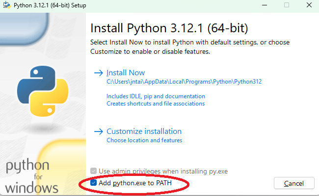
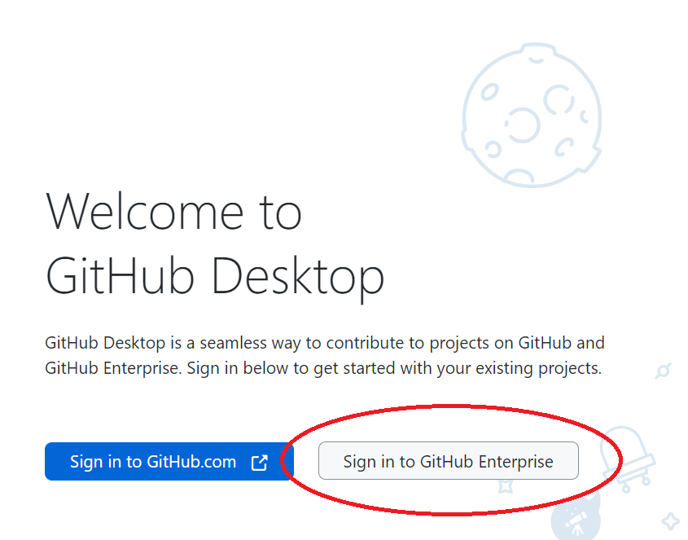
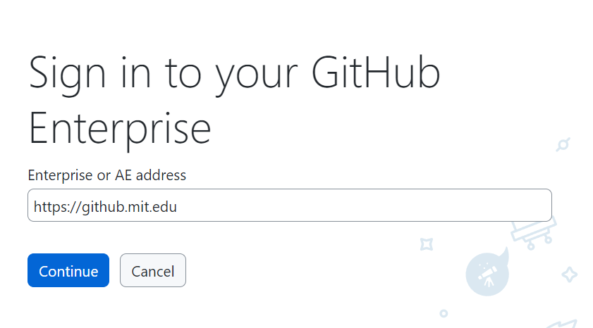
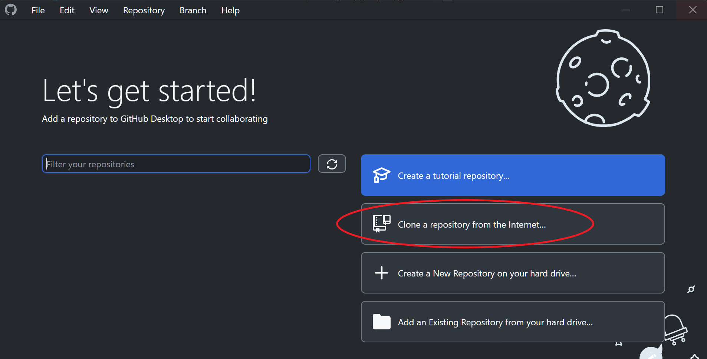
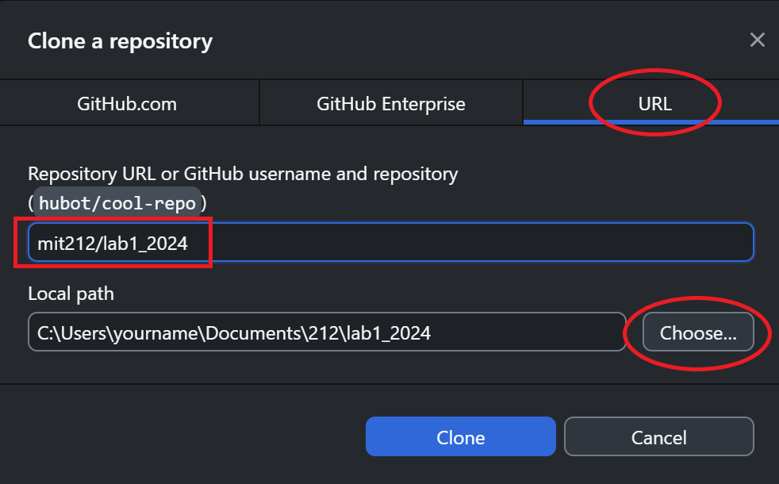
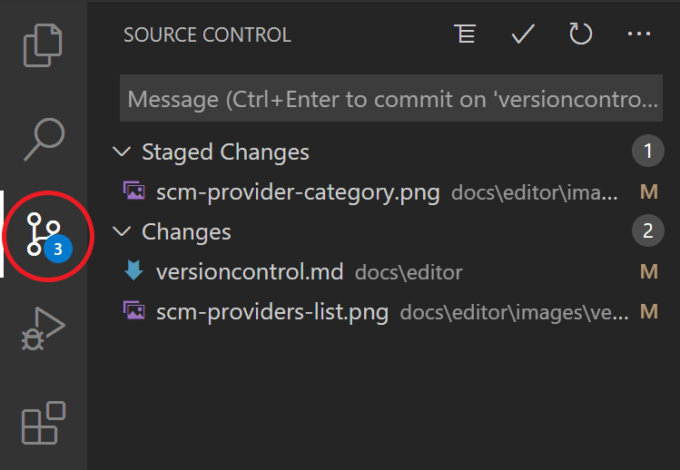

# Lab 1: DC Motor Basics

2.12/2.120 Intro to Robotics  
Spring 2024[^1]

## Table of Contents
- [Lab 1: DC Motor Basics](#lab-1-dc-motor-basics)
  - [Table of Contents](#table-of-contents)  
  - [0 Pre-Lab: Software Set Up](#0-pre-lab-software-set-up)
    - [0.1 Visual Studio Code](#01-visual-studio-code-vscode)
    - [0.2 PlatformIO](#02-platformio)
    - [0.3 Python](#03-python)
    - [0.4 GitHub Desktop](#04-github-desktop)
  - [1 Hardware Set Up](#1-hardware-set-up)
  - [2 Validating the Microcontroller](#2-validating-the-microcontroller)
    - [2.1 Git Clone](#21-git-clone)
    - [2.2 Uploading Code on the Microcontroller](#22-uploading-code-on-the-microcontroller)
  - [3 Validating the Motor](#3-validating-the-motor)
    - [3.1 Motor Controller Actuation](#31-motor-controller-actuation)
    - [3.2 Wiring up the Motor and Microcontroller](#32-wiring-up-the-motor-and-microcontroller)
    - [3.3 Microcontroller Actuation](#33-microcontroller-actuation)
  - [4 Validating the Encoder](#4-validating-the-encoder)
    - [4.1 Wiring up the Encoder and Microcontroller](#41-wiring-up-the-encoder-and-microcontroller)
    - [4.2 Testing the Encoder](#42-testing-the-encoder)
  - [X Optional](#x-optional)
    - [X.1 Controlling the Motor via Joystick](#x1-controlling-the-motor-via-joystick)
    - [X.2 Git through VSCode Source Control](#x2-git-through-vscode-source-control)

## 0 Pre-Lab: Software Set Up
Please install the following software.

If you run into any bugs or encounter issues during the installation process, feel free to contact the lab staff via Piazza! We can also resolve issues during the first lab, but having these installed in advance will make the lab experience run smoother.

### 0.1 Visual Studio Code (VSCode)

1. Download VSCode here: https://code.visualstudio.com/Download.

<i> FAQs </i>

- **What version of VSCode do I need?**  
Any version should work. If you are installing for the first time, please use the latest stable build.  
- **Can I use a different code editor?**  
We prefer VSCode since we will use the [PlatformIO plug-in](#02-platformio).

### 0.2 PlatformIO

PlatformIO is an open-source ecosystem for IoT development with support for various microcontroller platforms. The PlatformIO extension in VSCode provides a seamless environment for embedded systems programming. We will be using the Arduino ecosystem in PlatformIO, so if you are familiar with programming microcontrollers using the Arduino IDE, the code will look familiar.

1. Open the VSCode application.
2. Go to the Extensions view by clicking on the Extensions icon in the Activity Bar on the side of the window and search for "PlatformIO IDE" in the search bar.
3. Find the PlatformIO IDE extension in the search results and click "Install".
  
### 0.3 Python

1. Download Python here: https://www.python.org/downloads/.
2. Make sure to check "Add python.exe to PATH".

3. Click "Install Now" and finish the installation.

<i> FAQs </i>

- **What version of Python do I need?**  
We recommend at least 3.8 to ensure compatibility with the packages we will use in this class. If you already have Python, you should be able to check its version by entering the command `python --version` in your terminal. 

- **How do I check that I installed Python correctly?**  
Entering the command `python` in your terminal should return `Python X.X (tags...`. If it instead returns `python is not recognized as an internal or external command, operable program, or batch file` or `python: command not found`, you may have forgotten to add Python to PATH during installation. You can fix this using the following instructions: [How to Add Python to PATH](https://realpython.com/add-python-to-path/).

- **I already have Miniconda/Anaconda Python. Do I need to get vanilla Python?**  
We recommend getting vanilla Python. The staff may not be able to help troubleshoot issues relating to `conda`.

### 0.4 GitHub Desktop

GitHub Desktop provides a simplified user interface for Git, a distributed version control system that allows for efficient collaboration and tracking changes in code. We will use Git to manage our code repositories. 

1. Download GitHub Desktop here: https://desktop.github.com/.
2. Click "Sign in to GitHub Enterprise".

3. Enter "https://github.mit.edu" and sign in using your MIT Kerberos credentials.

## 1 Hardware Set up

For today's lab, you should have the following parts:
- DC motor set up (which we have already assembled for you)
- Motor controller
- Power supply
- ESP32-S3 microcontroller (https://esp32s3.com/)
- Breadboard
- Jumper cables
- USB-C cable

**INSERT PICTURE OF SETUP HERE WITH LABELS OF WHAT IS WHAT**

## 2 Validating the Microcontroller

Before connecting the microcontroller to the rest of the system, we want to make sure it works on its own.

### 2.1 Git Clone
This GitHub repository contains all the code you need for this lab. In order to make a local copy of this repository, you need to *clone* it.
1. Open the GitHub Desktop application.
2. Click "Clone a repository from the Internet..."
  
3. Click the "URL" tab and enter "mit212/lab1_2024" under Repository URL. For Local path, click "Choose" to specify where you want the files to be saved on your local machine.
  
4. Click "Clone".

### 2.2 Uploading Code on the Microcontroller
Now that you have the code on your machine, you can *upload* it on the microcontroller. This is a process we will repeat not only in this lab but throughout the semester, so try to remember the steps! We will upload a simple test that causes the onboard LED to blink.
1. Open the VSCode application.
2. Click "Open Folder..." and select the `lab1_2024` folder you just cloned.
3. Click `Default(lab1_2024)` at the bottom of the screen to switch the PlatformIO Project Environment.
    
4. Click `env:robot` from the dropdown at the top of the screen. This environment tells PlatformIO to compile all code in the `src/robot` folder only.  
    
5. Rearrange the files within the `src/` directory such that `blink_test.cpp` is in `src/robot/` and all the other `.cpp` files are in `src/test_code/`. 
 
6. Connect the microcontroller to your machine using a USB-C cable.
7. Put the microcontroller into *download* mode by holding down the onboard `[BOOT]` button, clicking the adjacent `[RST]` button, and then releasing `[BOOT]`. **Depending on your machine, you may have to do you this every time you want to upload code on your microcontroller.**
8. Click the right arrow at the bottom of the screen to upload code on the microcontroller
    
9. Finally, run the code by clicking `[RST]`. You should see the onboard LED blink! 

## 3 Validating the Motor

Now that we have confirmed the microcontroller is working, we want to test the motor and motor controller.

### 3.1 Motor Controller Actuation

We will start by actuating the motors using only the motor controller. 
1. Connect the motor power cables to the motor controller cables (`M-` to `M1A` and `M+` to `M1B`).
2. Plug in the power supply output to the motor controller input. 
3. Push and hold the `M1A` and `M1B` buttons on the motor controller one at a time to see the wheel spin! Each button should spin the wheel in opposite directions. 

### 3.2 Wiring up the Motor and Microcontroller 
We will then wire the motor controller to the microcontroller so that we can use code to command the motors. 

1. Open `include/pinout.h` and find the assigned motor `DIR1` and `PWM1` pin numbers. 
2. Plug the microcontroller into the breadboard.
    

    
<i> How do I use a breadboard?</i>
    

    If this is your first time using a breadboard, please refer to this [online guide](https://learn.sparkfun.com/tutorials/how-to-use-a-breadboard/) or approach a TA or LA for a crash course!
    

3. Use the jumper cables to connect the following:
    | motor controller | microcontroller | suggested cable color |
    | ------------- | ------------- | ------------- |
    | `DIR1`  | from step 1  | orange |
    | `PWM1`  | from step 1 | white |
    | `GND` | **`-`** (`GND`)| black or brown |

    Note: We have suggested jumper cable colors for convention, but remember that the **colors alone don't mean anything**! If you see a black jumper cable in the future, don't automatically assume that it must be ground.
4. Examine the *schematic* below and confirm that it corresponds to the wiring you just did. Make sure you completely understand the correspondence as you will only be provided with a schematic for the next wiring task! Feel free to clarify with a TA or LA if needed.

    **INSERT SCHEMATIC HERE**

### 3.3 Microcontroller Actuation
   
Finally, we will upload the provided motor test code on the microcontroller!
1. Repeat the process outlined in the [previous section](#22-uploading-code-on-the-microcontroller) to run `motor_drive_test.cpp` instead of `blink_test.cpp`. The wheel should spin in different directions with varied speeds.
2. The power supply has a knob to vary its output voltage. Try changing this to about `10V`, `7V`, then `3V`. Notice that the wheel spins slower overall at lower voltages, and doesn't spin at all below certain voltages! This is because the motor controller has a lower limit it needs to surpass in order to function. 
3. Change the output voltage back to about `15V`.

    | :white_check_mark: CHECKOFF 1 :white_check_mark:   |
    |:---------------------------------------------------|
    | Demonstrate `motor_drive_test.cpp` to a TA or LA. |

## 4 Validating the Encoder

We can now test our entire system consisting of the microcontroller, motor, motor controller, and encoder.

### 4.1 Wiring up the Encoder and Microcontroller 

Using what you learned about reading schematics in the [previous section](#32-wiring-up-the-motor-and-microcontroller), wire up the encoder to the microcontroller based on the schematics below! 

**INSERT SCHEMATICS HERE**

Hint: You only need to connect the 4 encoder wires to the microcontroller through the breadboard. Remember to refer to `include/pinout.h` for missing pin numbers. If you need help, don't be afraid to ask a TA or LA!

### 4.2 Testing the Encoder
To see the encoder in action, we will upload the provided encoder test code on the microcontroller.
1. Ensure that the motor controller is powered off by unplugging the power supply cable connection.
2. Upload and run `encoder_test.cpp`. 
3. Open the Serial Monitor.
    
4. Rotate the wheel. Observe that counter-clockwise motion increases the encoder count, while clockwise motion decreases it!

    **INSERT PICTURE OF ENCODER COUNT?**

    | :white_check_mark: CHECKOFF 2 :white_check_mark:   |
    |:---------------------------------------------------|
    | Demonstrate `encoder_test.cpp` to a TA or LA. |

## X Optional 

### X.1 Controlling the Motor via Joystick

**Add optional exercise, schematics and skeleton code needed**

### X.2 Git through VSCode Source Control

An alternative to GitHub Desktop is VSCode's built-in Source Control. You can access it by clicking the Source Control icon in the Activity Bar on the left. 

Since it relies on your local machine's installation of Git, you will need to install Git in addition to GitHub Desktop. You will also need to set up an SSH key in order to commit changes to GitHub repositories.

1. Download Git here: https://git-scm.com/downloads.
2. If you don't have one yet, create an account on [GitHub.com](https://github.com/join/).
3. Generate a new SSH key using the following instructions: [Generating a new SSH key](https://docs.github.com/en/authentication/connecting-to-github-with-ssh/generating-a-new-ssh-key-and-adding-it-to-the-ssh-agent#generating-a-new-ssh-key).
4. Add the SSH key to the ssh-agent using the following instructions: [Adding your SSH key to the ssh-agent](https://docs.github.com/en/authentication/connecting-to-github-with-ssh/generating-a-new-ssh-key-and-adding-it-to-the-ssh-agent#adding-your-ssh-key-to-the-ssh-agent).
5. Add the SSH key to your GitHub account using the following instructions: [Adding a new SSH key to your GitHub account](https://docs.github.com/en/authentication/connecting-to-github-with-ssh/adding-a-new-ssh-key-to-your-github-account). Stop once you reach the section "Generating a new SSH key for a hardware security key."

Unfortunately, VSCode Source Control has no native method for cloning GitHub repositories. However, you might find its interface more intuitive for other Git commands we will introduce in future labs!

[^1]: Version 1 - 2024: Joseph Ntaimo, Josh Sohn, Jinger Chong
